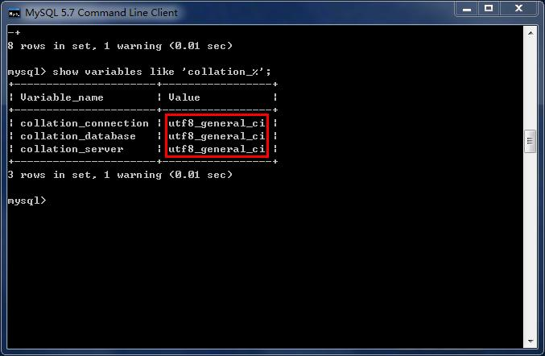

---
prev:
  text: "数据库概述"
  link: "/backend/mysql/basic01"
next:
  text: "基本的 SELECT 语句"
  link: "/backend/mysql/basic03"
---

# 第 02 章 MySQL 环境搭建

## 1. MySQL 的卸载

### 步骤 1：停止 MySQL 服务

在卸载之前，先停止 MySQL8.0 的服务。按键盘上的“Ctrl + Alt + Delete”组合键，打开“任务管理器”对话
框，可以在“服务”列表找到“MySQL8.0”的服务，如果现在“正在运行”状态，可以右键单击服务，选择“停止”选项停止 MySQL8.0 的服务。

### 步骤 2：软件的卸载

#### 方式 1：通过控制面板方式

卸载 MySQL8.0 的程序可以和其他桌面应用程序一样直接在“控制面板”选择“卸载程序”，并在程序列表中
找到 MySQL8.0 服务器程序，直接双击卸载即可，如图所示。这种方式删除，数据目录下的数据不会跟着
删除。

#### 方式 2：通过 360 或电脑管家等软件卸载

略

#### 方式 3：通过安装包提供的卸载功能卸载

你也可以通过安装向导程序进行 MySQL8.0 服务器程序的卸载。

① 再次双击下载的 mysql-installer-community-8.0.26.0.msi 文件，打开安装向导。安装向导会自动检测已
安装的 MySQL 服务器程序。

② 选择要卸载的 MySQL 服务器程序，单击“Remove”（移除），即可进行卸载。

### 步骤 3：残余文件的清理

如果再次安装不成功，可以卸载后对残余文件进行清理后再安装。

（1）服务目录：mysql 服务的安装目录

（2）数据目录：默认在 C:\ProgramData\MySQL

如果自己单独指定过数据目录，就找到自己的数据目录进行删除即可。

> 注意：请在卸载前做好数据备份
>
> 在操作完以后，需要重启计算机，然后进行安装即可。如果仍然安装失败，需要继续操作如下步骤 4。

### 步骤 4：清理注册表（选做）

如果前几步做了，再次安装还是失败，那么可以清理注册表。

如何打开注册表编辑器：在系统的搜索框中输入 `regedit`

> 注册表中的 ControlSet001, ControlSet002, 不一定是 001 和 002, 可能是 ControlSet005、006 之类

### 步骤 5：删除环境变量配置

找到 path 环境变量，将其中关于 mysql 的环境变量删除，切记不要全部删除。

## 2. MySQL 的下载、安装、配置

### 2.1 MySQL 的 4 大版本

> - **MySQL Community Server 社区版本**，开源免费，自由下载，但不提供官方技术支持，适用于大多数普通用户。
> - **MySQL Enterprise Edition 企业版本**，需付费，不能在线下载，可以试用 30 天。提供了更多的功能和更完备的技术支持，更适合于对数据库的功能和可靠性要求较高的企业客户。
> - **MySQL Cluster 集群版**，开源免费。用于架设集群服务器，可将几个 MySQL Server 封装成一个 Server。需要在社区版或企业版的基础上使用。
> - **MySQL Cluster CGE 高级集群版**，需付费。

目前最新版本为 8.0.27 ，发布时间 2021 年 10 月 。此前，8.0.0 在 2016.9.12 日就发布了。本教程中使用 8.0.26 版本 。

此外，官方还提供了 MySQL Workbench （GUITOOL）一款专为 MySQL 设计的 图形界面管理工具 。
MySQLWorkbench 又分为两个版本，分别是 社区版 （MySQL Workbench OSS）、 商用版 （MySQL
WorkbenchSE）。

### 2.2 软件的下载

略

### 2.3 MySQL8.0 版本的安装

略

### 2.4 配置 MySQL8.0

略

### 2.5 配置 MySQL8.0 环境变量

如果不配置 MySQL 环境变量，就不能在命令行直接输入 MySQL 登录命令。下面说如何配置 MySQL 的环境
变量：

步骤 1：在桌面上右击【此电脑】图标，在弹出的快捷菜单中选择【属性】菜单命令。

步骤 2：打开【系统】窗口，单击【高级系统设置】链接。

步骤 3：打开【系统属性】对话框，选择【高级】选项卡，然后单击【环境变量】按钮。

步骤 4：打开【环境变量】对话框，在系统变量列表中选择 path 变量。

步骤 5：单击【编辑】按钮，在【编辑环境变量】对话框中，将 MySQL 应用程序的 bin 目录（C:\ProgramFiles\MySQL\MySQL Server 8.0\bin）添加到变量值中，用分号将其与其他路径分隔开。

步骤 6：添加完成之后，单击【确定】按钮，这样就完成了配置 path 变量的操作，然后就可以直接输入 MySQL 命令来登录数据库了。

### 2.6 MySQL5.7 版本的安装、配置

* 安装

此版本的安装过程与上述过程除了版本号不同之外，其它环节都是相同的。所以这里省略了 MySQL5.7.34
版本的安装截图。

* 配置

配置环节与 MySQL8.0 版本确有细微不同。大部分情况下直接选择“Next”即可，不影响整理使用。
这里配置 MySQL5.7 时，重点强调：**与前面安装好的 MySQL8.0 不能使用相同的端口号**。

### 2.7 安装失败问题

略

## 3. MySQL 的登录

### 3.1 服务的启动与停止

MySQL 安装完毕之后，需要启动服务器进程，不然客户端无法连接数据库。

在前面的配置过程中，已经将 MySQL 安装为 Windows 服务，并且勾选当 Windows 启动、停止时，MySQL 也
自动启动、停止。

**方式 1：使用图形界面工具**

* 步骤 1：打开 windows 服务
  + 方式 1：计算机（点击鼠标右键）→ 管理（点击）→ 服务和应用程序（点击）→ 服务（点
    击）

  + 方式 2：控制面板（点击）→ 系统和安全（点击）→ 管理工具（点击）→ 服务（点击）
  + 方式 3：任务栏（点击鼠标右键）→ 启动任务管理器（点击）→ 服务（点击）
  + 方式 4：单击【开始】菜单，在搜索框中输入“services.msc”，按 Enter 键确认
* 步骤 2：找到 MySQL80（点击鼠标右键）→ 启动或停止（点击）

**方式 2：使用命令行工具**

```shell
# 启动 MySQL 服务命令：
net start MySQL服务名
# 停止 MySQL 服务命令：
net stop MySQL服务名
```

说明：

1. start 和 stop 后面的服务名应与之前配置时指定的服务名一致。
2. 如果当你输入命令后，提示“拒绝服务”，请以 系统管理员身份 打开命令提示符界面重新尝试。

### 3.2 自带客户端的登录与退出

当 MySQL 服务启动完成后，便可以通过客户端来登录 MySQL 数据库。注意：确认服务是开启的。

**登录方式 1：MySQL 自带客户端**

开始菜单 → 所有程序 → MySQL → MySQL 8.0 Command Line Client

> 说明：仅限于 root 用户

**登录方式 2：windows 命令行**

* 格式：

```shell
mysql -h 主机名 -P 端口号 -u 用户名 -p密码
```

* 举例：

```shell
mysql -h localhost -P 3306 -u root -pabc123
# 这里我设置的root用户的密码是abc123
```

注意：

（1）-p 与密码之间不能有空格，其他参数名与参数值之间可以有空格也可以没有空格。如：

```shell
mysql -hlocalhost -P3306 -uroot -pabc123
```

（2）密码建议在下一行输入，保证安全

```shell
mysql -h localhost -P 3306 -u root -p
Enter password:****
```

（3）客户端和服务器在同一台机器上，所以输入 localhost 或者 IP 地址 127.0.0.1。同时，因为是连接本
机： -hlocalhost 就可以省略，如果端口号没有修改：-P3306 也可以省略

简写成：

```shell
mysql -u root -p
Enter password:****
```

连接成功后，有关于 MySQL Server 服务版本的信息，还有第几次连接的 id 标识。

也可以在命令行通过以下方式获取 MySQL Server 服务版本的信息：

```shell
c:\> mysql -V
c:\> mysql --version
```

或登录后，通过以下方式查看当前版本信息：

```shell
mysql> select version();
```

**退出登录**

```shell
exit
# 或
quit
```

## 4. MySQL 演示使用

### 4.1 MySQL 的使用演示

1、查看所有的数据库

```shell
show databases;
```

> “information_schema”是 MySQL 系统自带的数据库，主要保存 MySQL 数据库服务器的系统信息，比如数据库的名称、数据表的名称、字段名称、存取权限、数据文件 所在的文件夹和系统使用的文件夹，等等。
>
> “performance_schema”是 MySQL 系统自带的数据库，可以用来监控 MySQL 的各类性能指标。 “sys”数据库是 MySQL 系统自带的数据库，主要作用是以一种更容易被理解的方式展示 MySQL 数据库服务器的各类性能指标，帮助系统管理员和开发人员监控 MySQL 的技术性能。
>
> “mysql”数据库保存了 MySQL 数据库服务器运行时需要的系统信息，比如数据文件夹、当前使用的字符集、约束检查信息，等等

为什么 Workbench 里面我们只能看到“demo”和“sys”这 2 个数据库呢？

这是因为，Workbench 是图形化的管理工具，主要面向开发人 员，“demo”和“sys”这 2 个数据库已经够用
了。如果有特殊需求，比如，需要监控 MySQL 数据库各项性能指标、直接操作 MySQL 数据库系统文件
等，可以由 DBA 通过 SQL 语句，查看其它的系统数据库。

2、创建自己的数据库

```shell
create database 数据库名;
#创建atguigudb数据库，该名称不能与已经存在的数据库重名。
create database atguigudb;
```

3、使用自己的数据库

```shell
use 数据库名;
#使用atguigudb数据库
use atguigudb;
```

说明：如果没有使用 use 语句，后面针对数据库的操作也没有加“数据名”的限定，那么会报 `ERROR 1046(3D000): No database selected` （没有选择数据库）

使用完 use 语句之后，如果接下来的 SQL 都是针对一个数据库操作的，那就不用重复 use 了，如果要针对另一个数据库操作，那么要重新 use。

4、查看某个库的所有表格

```shell
show tables; #要求前面有use语句
show tables from 数据库名;
```

5、创建新的表格

```shell
create table 表名称(
    字段名 数据类型,
    字段名 数据类型
);
```

说明：如果是最后一个字段，后面就用加逗号，因为逗号的作用是分割每个字段。

```shell
#创建学生表
create table student(
    id int,
    name varchar(20) #说名字最长不超过20个字符
);
```

6、查看一个表的数据

```sql
select * from 数据库表名称;
#查看学生表的数据
select * from student;
```

7、添加一条记录

```sql
insert into 表名称 values(值列表);
#添加两条记录到student表中
insert into student values(1,'张三');
insert into student values(2,'李四');
```

报错：

```sql
mysql> insert into student values(1,'张三');
ERROR 1366 (HY000): Incorrect string value: '\xD5\xC5\xC8\xFD' for column 'name' at row 1
mysql> insert into student values(2,'李四');
ERROR 1366 (HY000): Incorrect string value: '\xC0\xEE\xCB\xC4' for column 'name' at row 1
mysql> show create table student;
```

字符集的问题。

8、查看表的创建信息

```sql
show create table 表名称\G
#查看student表的详细创建信息
show create table student\G
#结果如下
*************************** 1. row ***************************
Table: student
Create Table: CREATE TABLE `student` (
    `id` int(11) DEFAULT NULL,
    `name` varchar(20) DEFAULT NULL
) ENGINE=InnoDB DEFAULT CHARSET=latin1
1 row in set (0.00 sec)
```

上面的结果显示 student 的表格的默认字符集是“latin1”不支持中文。

9、查看数据库的创建信息

```sql
show create database 数据库名\G
#查看atguigudb数据库的详细创建信息
show create database atguigudb\G
#结果如下
*************************** 1. row ***************************
Database: atguigudb
Create Database: CREATE DATABASE `atguigudb` /*!40100 DEFAULT CHARACTER SET latin1 */
1 row in set (0.00 sec)
```

上面的结果显示 atguigudb 数据库也不支持中文，字符集默认是 latin1。

10、删除表格

```sql
drop table 表名称;
```

```sql
#删除学生表
drop table student;
```

11、删除数据库

```sql
drop database 数据库名;
```

```sql
#删除atguigudb数据库
drop database atguigudb;
```

### 4.2 MySQL 的编码设置

#### MySQL5.7 中

**问题再现：命令行操作 sql 乱码问题**

```sql
mysql> INSERT INTO t_stu VALUES(1,'张三','男');
ERROR 1366 (HY000): Incorrect string value: '\xD5\xC5\xC8\xFD' for column 'sname' at
row 1
```

**问题解决**

步骤 1：查看编码命令

```sql
show variables like 'character_%';
show variables like 'collation_%';
```

步骤 2：修改 mysql 的数据目录下的 my.ini 配置文件

```shell
[mysql] #大概在63行左右，在其下添加
...
default-character-set=utf8 #默认字符集
[mysqld] # 大概在76行左右，在其下添加
...
character-set-server=utf8
collation-server=utf8_general_ci
```

> 注意：建议修改配置文件使用 notepad++等高级文本编辑器，使用记事本等软件打开修改后可能会
> 导致文件编码修改为“含 BOM 头”的编码，从而服务重启失败。

#### MySQL8.0 中

在 MySQL 8.0 版本之前，默认字符集为 latin1，utf8 字符集指向的是 utf8mb3。网站开发人员在数据库设计
的时候往往会将编码修改为 utf8 字符集。如果遗忘修改默认的编码，就会出现乱码的问题。从 MySQL 8.0
开始，数据库的默认编码改为 utf8mb4 ，从而避免了上述的乱码问题。

步骤 3：重启服务

步骤 4：查看编码命令

```sql
show variables like 'character_%';
show variables like 'collation_%';
```




如果是以上配置就说明对了。接着我们就可以新创建数据库、新创建数据表，接着添加包含中文的
数据了。

## 5. MySQL 图形化管理工具

MySQL 图形化管理工具极大地方便了数据库的操作与管理，常用的图形化管理工具有：MySQL
Workbench、phpMyAdmin、Navicat Preminum、MySQLDumper、SQLyog、dbeaver、MySQL ODBC
Connector。

### 5.1 MySQL Workbench

MySQL 官方提供的图形化管理工具 MySQL Workbench 完全支持 MySQL 5.0 以上的版本。MySQL Workbench
分为社区版和商业版，社区版完全免费，而商业版则是按年收费。

MySQL Workbench 为数据库管理员、程序开发者和系统规划师提供可视化设计、模型建立、以及数据库
管理功能。它包含了用于创建复杂的数据建模 ER 模型，正向和逆向数据库工程，也可以用于执行通常需
要花费大量时间的、难以变更和管理的文档任务。

下载地址：[http://dev.mysql.com/downloads/workbench/](http://dev.mysql.com/downloads/workbench/)。

使用：略。

### 5.2 Navicat

Navicat MySQL 是一个强大的 MySQL 数据库服务器管理和开发工具。它可以与任何 3.21 或以上版本的
MySQL 一起工作，支持触发器、存储过程、函数、事件、视图、管理用户等，对于新手来说易学易用。
其精心设计的图形用户界面（GUI）可以让用户用一种安全简便的方式来快速方便地创建、组织、访问和
共享信息。Navicat 支持中文，有免费版本提供。 下载地址：[http://www.navicat.com/](http://www.navicat.com/)。

### 5.3 SQLyog

SQLyog 是业界著名的 Webyog 公司出品的一款简洁高效、功能强大的图形化 MySQL 数据库管理工具。
这款工具是使用 C++语言开发的。该工具可以方便地创建数据库、表、视图和索引等，还可以方便地进行
插入、更新和删除等操作，同时可以方便地进行数据库、数据表的备份和还原。该工具不仅可以通过
SQL 文件进行大量文件的导入和导出，还可以导入和导出 XML、HTML 和 CSV 等多种格式的数据。 下载地
址：[http://www.webyog.com/](http://www.webyog.com/)，读者也可以搜索中文版的下载地址。

### 5.4 dbeaver

DBeaver 是一个通用的数据库管理工具和 SQL 客户端，支持所有流行的数据库：MySQL、PostgreSQL、
SQLite、Oracle、DB2、SQL Server、 Sybase、MS Access、Teradata、 Firebird、Apache Hive、Phoenix、
Presto 等。DBeaver 比大多数的 SQL 管理工具要轻量，而且支持中文界面。DBeaver 社区版作为一个免费开
源的产品，和其他类似的软件相比，在功能和易用性上都毫不逊色。

唯一需要注意是 DBeaver 是用 Java 编程语言开发的，所以需要拥有 JDK（Java Development ToolKit）环
境。如果电脑上没有 JDK，在选择安装 DBeaver 组件时，勾选“Include Java”即可。下载地址：[https://dbeaver.io/download/](https://dbeaver.io/download/)。

可能出现连接问题：

有些图形界面工具，特别是旧版本的图形界面工具，在连接 MySQL8 时出现“Authentication plugin 'caching_sha2_password' cannot be loaded”错误。

出现这个原因是 MySQL8 之前的版本中加密规则是 mysql_native_password，而在 MySQL8 之后，加密规则
是 caching_sha2_password。解决问题方法有两种，第一种是升级图形界面工具版本，第二种是把 MySQL8
用户登录密码加密规则还原成 mysql_native_password。

第二种解决方案如下，用命令行登录 MySQL 数据库之后，执行如下命令修改用户密码加密规则并更新用
户密码，这里修改用户名为“root@localhost”的用户密码规则为“mysql_native_password”，密码值为
“123456”。

```sql
#使用mysql数据库
USE mysql;
#修改'root'@'localhost'用户的密码规则和密码
ALTER USER 'root'@'localhost' IDENTIFIED WITH mysql_native_password BY 'abc123';
#刷新权限
FLUSH PRIVILEGES;
```

## 6. MySQL 目录结构与源码

### 6.1 主要目录结构

| MySQL 的目录结构                             | 说明                                   |
| -------------------------------------------- | -------------------------------------- |
| bin 目录                                     | 所有 MySQL 的可执行文件。如：mysql.exe |
| MySQLInstanceConfig.exe                      | 数据库的配置向导，在安装时出现的内容   |
| data 目录                                    | 系统数据库所在的目录                   |
| my.ini 文件                                  | MySQL 的主要配置文件                   |
| c:\ProgramData\MySQL\MySQL Server 8.0\data\  | 用户创建的数据库所在的目录             |

### 6.2 MySQL 源代码获取

首先，你要进入 MySQL 下载界面。 这里你不要选择用默认的“Microsoft Windows”，而是要通过下拉栏，
找到“Source Code”，在下面的操作系统版本里面， 选择 Windows（Architecture Independent），然后点
击下载。

接下来，把下载下来的压缩文件解压，我们就得到了 MySQL 的源代码。

MySQL 是用 C++ 开发而成的，我简单介绍一下源代码的组成。

mysql-8.0.22 目录下的各个子目录，包含了 MySQL 各部分组件的源代码：

* sql 子目录是 MySQL 核心代码；
* libmysql 子目录是客户端程序 API；
* mysql-test 子目录是测试工具；
* mysys 子目录是操作系统相关函数和辅助函数；

源代码可以用记事本打开查看，如果你有 C++ 的开发环境，也可以在开发环境中打开查看。

## 7. 常见问题的解决(课外内容)

### 问题 1：root 用户密码忘记，重置的操作

1: 通过任务管理器或者服务管理，关掉 mysqld(服务进程)

2: 通过命令行+特殊参数开启 mysqld mysqld --defaults-file="D:\ProgramFiles\mysql\MySQLServer5.7Data\my.ini" --skip-grant-tables

3: 此时，mysqld 服务进程已经打开。并且不需要权限检查

4: mysql -uroot 无密码登陆服务器。另启动一个客户端进行

5: 修改权限表 （1） use mysql; （2）update user set authentication_string=password('新密
码') where user='root' and Host='localhost'; （3）flush privileges; 

6: 通过任务管理器，关掉 mysqld 服务进程。

7: 再次通过服务管理，打开 mysql 服务。 8: 即可用修改后的新密码登陆。

### 问题 2：mysql 命令报“不是内部或外部命令”

如果输入 mysql 命令报“不是内部或外部命令”，把 mysql 安装目录的 bin 目录配置到环境变量 path 中。如
下：


### 问题 3：错误 ERROR ：没有选择数据库就操作表格和数据

 `ERROR 1046 (3D000): No database selected`

解决方案一：就是使用“USE 数据库名; ”语句，这样接下来的语句就默认针对这个数据库进行操作

解决方案二：就是所有的表对象前面都加上“数据库.”

### 问题 4：命令行客户端的字符集问题

```sql
mysql> INSERT INTO t_stu VALUES(1,'张三','男');
ERROR 1366 (HY000): Incorrect string value: '\xD5\xC5\xC8\xFD' for column 'sname' at
row 1
```

原因：服务器端认为你的客户端的字符集是 utf-8，而实际上你的客户端的字符集是 GBK。

查看所有字符集： `SHOW VARIABLES LIKE 'character_set_%';`

解决方案，设置当前连接的客户端字符集 `SET NAMES GBK;`

### 问题 5：修改数据库和表的字符编码

修改编码：

（1）先停止服务，（2）修改 my.ini 文件（3）重新启动服务

说明：

如果是在修改 my.ini 之前建的库和表，那么库和表的编码还是原来的 Latin1，要么删了重建，要么使用
alter 语句修改编码。

```sql
mysql> create database 0728db charset Latin1;
Query OK, 1 row affected (0.00 sec)
```

```sql
mysql> use 0728db;
Database changed
```

```sql
mysql> create table student (id int , name varchar(20)) charset Latin1;
Query OK, 0 rows affected (0.02 sec)
mysql> show create table student\G
*************************** 1. row ***************************
Table: student
Create Table: CREATE TABLE `student` (
    `id` int(11) NOT NULL,
    `name` varchar(20) DEFAULT NULL,
    PRIMARY KEY (`id`)
) ENGINE=InnoDB DEFAULT CHARSET=latin1
1 row in set (0.00 sec)
```

```sql
mysql> alter table student charset utf8; #修改表字符编码为UTF8
Query OK, 0 rows affected (0.01 sec)
Records: 0 Duplicates: 0 Warnings: 0

mysql> show create table student\G
*************************** 1. row ***************************
Table: student
Create Table: CREATE TABLE `student` (
    `id` int(11) NOT NULL,
    `name` varchar(20) CHARACTER SET latin1 DEFAULT NULL, #字段仍然是latin1编码
    PRIMARY KEY (`id`)
) ENGINE=InnoDB DEFAULT CHARSET=utf8
1 row in set (0.00 sec)

mysql> alter table student modify name varchar(20) charset utf8; #修改字段字符编码为UTF8
Query OK, 0 rows affected (0.05 sec)
Records: 0 Duplicates: 0 Warnings: 0

mysql> show create table student\G
*************************** 1. row ***************************
Table: student
Create Table: CREATE TABLE `student` (
    `id` int(11) NOT NULL,
    `name` varchar(20) DEFAULT NULL,
    PRIMARY KEY (`id`)
) ENGINE=InnoDB DEFAULT CHARSET=utf8
1 row in set (0.00 sec)
```

```sql
mysql> show create database 0728db;;
+--------+-----------------------------------------------------------------+
|Database| Create Database |
+------+-------------------------------------------------------------------+
|0728db| CREATE DATABASE `0728db` /*!40100 DEFAULT CHARACTER SET latin1 */ |
+------+-------------------------------------------------------------------+
1 row in set (0.00 sec)

mysql> alter database 0728db charset utf8; #修改数据库的字符编码为utf8
Query OK, 1 row affected (0.00 sec)
```

```sql
mysql> show create database 0728db;
+--------+-----------------------------------------------------------------+
|Database| Create Database |
+--------+-----------------------------------------------------------------+
| 0728db | CREATE DATABASE `0728db` /*!40100 DEFAULT CHARACTER SET utf8 */ |
+--------+-----------------------------------------------------------------+
1 row in set (0.00 sec)
```

<a-back-top />

<reading-progress-bar/>
