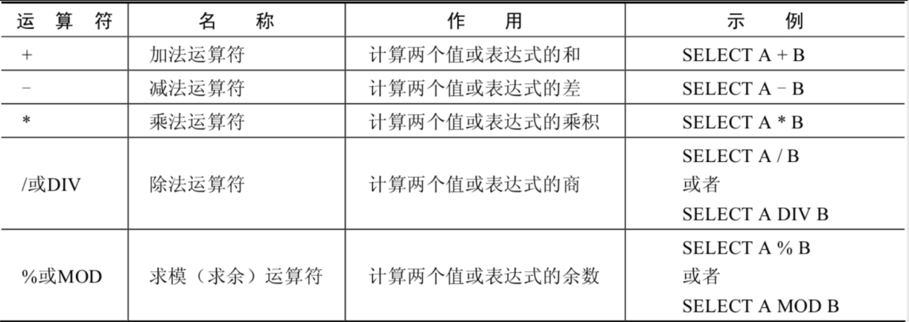

---
prev:
  text: "基本的 SELECT 语句"
  link: "/backend/mysql/basic03"
next:
  text: "排序与分页"
  link: "/backend/mysql/basic05"
---

# 第 04 章 运算符

## 1. 算术运算符

算术运算符主要用于数学运算，其可以连接运算符前后的两个数值或表达式，对数值或表达式进行加（+）、减（-）、乘（\*）、除（/）和取模（%）运算。



### 1.1 加法与减法运算符

```shell
mysql> SELECT 100, 100 + 0, 100 - 0, 100 + 50, 100 + 50 -30, 100 + 35.5, 100 - 35.5
FROM dual;
+-----+---------+---------+----------+--------------+------------+------------+
| 100 | 100 + 0 | 100 - 0 | 100 + 50 | 100 + 50 -30 | 100 + 35.5 | 100 - 35.5 |
+-----+---------+---------+----------+--------------+------------+------------+
| 100 | 100 | 100 | 150 | 120 | 135.5 | 64.5 |
+-----+---------+---------+----------+--------------+------------+------------+
1 row in set (0.00 sec)
```

由运算结果可以得出如下结论：

> - 一个整数类型的值对整数进行加法和减法操作，结果还是一个整数；
> - 一个整数类型的值对浮点数进行加法和减法操作，结果是一个浮点数；
> - 加法和减法的优先级相同，进行先加后减操作与进行先减后加操作的结果是一样的；
> - 在 Java 中，+的左右两边如果有字符串，那么表示字符串的拼接。但是在 MySQL 中+只表示数
>   值相加。如果遇到非数值类型，先尝试转成数值，如果转失败，就按 0 计算。（补充：MySQL
>   中字符串拼接要使用字符串函数 CONCAT()实现）

### 1.2 乘法与除法运算符

```shell
mysql> SELECT 100, 100 * 1, 100 * 1.0, 100 / 1.0, 100 / 2,100 + 2 * 5 / 2,100 /3, 100
DIV 0 FROM dual;
+-----+---------+-----------+-----------+---------+-----------------+---------+-------
----+
| 100 | 100 * 1 | 100 * 1.0 | 100 / 1.0 | 100 / 2 | 100 + 2 * 5 / 2 | 100 /3 | 100
DIV 0 |
+-----+---------+-----------+-----------+---------+-----------------+---------+-------
----+
| 100 | 100 | 100.0 | 100.0000 | 50.0000 | 105.0000 | 33.3333 |
NULL |
+-----+---------+-----------+-----------+---------+-----------------+---------+-------
----+
1 row in set (0.00 sec)
```

```shell
#计算出员工的年基本工资
SELECT employee_id,salary,salary * 12 annual_sal
FROM employees;
```

由运算结果可以得出如下结论：

> - 一个数乘以整数 1 和除以整数 1 后仍得原数；
> - 一个数乘以浮点数 1 和除以浮点数 1 后变成浮点数，数值与原数相等；
> - 一个数除以整数后，不管是否能除尽，结果都为一个浮点数；
> - 一个数除以另一个数，除不尽时，结果为一个浮点数，并保留到小数点后 4 位；
> - 乘法和除法的优先级相同，进行先乘后除操作与先除后乘操作，得出的结果相同。
> - 在数学运算中，0 不能用作除数，在 MySQL 中，一个数除以 0 为 NULL。

### 1.3 求模（求余）运算符

将 t22 表中的字段 i 对 3 和 5 进行求模（求余）运算。

```shell
mysql> SELECT 12 % 3, 12 MOD 5 FROM dual;
+--------+----------+
| 12 % 3 | 12 MOD 5 |
+--------+----------+
| 0 | 2 |
+--------+----------+
1 row in set (0.00 sec)
```

```shell
#筛选出employee_id是偶数的员工
SELECT * FROM employees
WHERE employee_id MOD 2 = 0;
```

可以看到，100 对 3 求模后的结果为 3，对 5 求模后的结果为 0。

## 2. 比较运算符

比较运算符用来对表达式左边的操作数和右边的操作数进行比较，比较的结果为真则返回 1，比较的结果
为假则返回 0，其他情况则返回 NULL。

比较运算符经常被用来作为 SELECT 查询语句的条件来使用，返回符合条件的结果记录。


### 2.1 等号运算符

### 2.2 安全等于运算符

### 2.3 不等于运算符

### 2.4 空运算符

### 2.5 非空运算符

### 2.6 最小值运算符

### 2.7 最大值运算符

### 2.8 BETWEEN AND 运算符

### 2.9 IN 运算符

### 2.10 NOT IN 运算符

### 2.11 LIKE 运算符

### 2.12 REGEXP 运算符

## 3. 逻辑运算符

## 4. 位运算符

## 5. 运算符的优先级

## 6. 拓展：使用正则表达式查询

<a-back-top />

<reading-progress-bar/>
