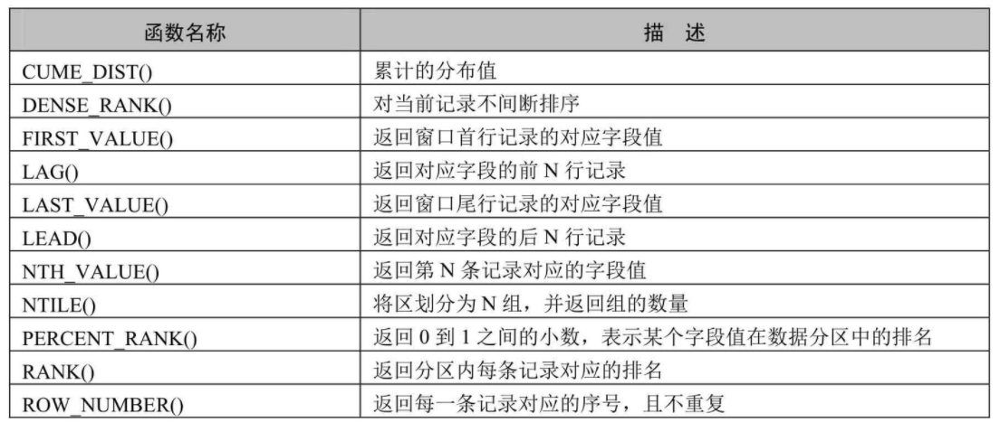

---
prev:
  text: "触发器"
  link: "/backend/mysql/basic17"
next:
  text: "MySQL 高级"
  link: "/backend/mysql/advance01"
---

# 第 18 章 MySQL8 其他特性

## 1. MySQL8 新特性概述

MySQL 从 5.7 版本直接跳跃发布了 8.0 版本，可见这是一个令人兴奋的里程碑版本。MySQL 8 版本在功能上
做了显著的改进与增强，开发者对 MySQL 的源代码进行了重构，最突出的一点是多 MySQL Optimizer 优化
器进行了改进。不仅在速度上得到了改善，还为用户带来了更好的性能和更棒的体验。

### 1.1 MySQL8.0 新增特性

1. **更简便的 NoSQL 支持**

NoSQL 泛指非关系型数据库和数据存储。随着互联网平台的规模飞速发展，传统
的关系型数据库已经越来越不能满足需求。从 5.6 版本开始，MySQL 就开始支持简单的 NoSQL 存储功能。
MySQL 8 对这一功能做了优化，以更灵活的方式实现 NoSQL 功能，不再依赖模式（schema）。

2. **更好的索引**

在查询中，正确地使用索引可以提高查询的效率。MySQL 8 中新增了隐藏索引和降序索
引。隐藏索引可以用来测试去掉索引对查询性能的影响。在查询中混合存在多列索引时，使用降序索引
可以提高查询的性能。

3. **更完善的 JSON 支持**

MySQL 从 5.7 开始支持原生 JSON 数据的存储，MySQL 8 对这一功能做了优化，增加
了聚合函数 `JSON_ARRAYAGG()` 和 `JSON_OBJECTAGG()`，将参数聚合为 JSON 数组或对象，新增了行内
操作符 ->>，是列路径运算符 ->的增强，对 JSON 排序做了提升，并优化了 JSON 的更新操作。

4. **安全和账户管理**

MySQL 8 中新增了 `caching_sha2_password` 授权插件、角色、密码历史记录和 FIPS
模式支持，这些特性提高了数据库的安全性和性能，使数据库管理员能够更灵活地进行账户管理工作。

5. **InnoDB 的变化**

InnoDB 是 MySQL 默认的存储引擎，是事务型数据库的首选引擎，支持事务安全表
（ACID），支持行锁定和外键。在 MySQL 8 版本中，InnoDB 在自增、索引、加密、死锁、共享锁等方面
做了大量的改进和优化 ，并且支持原子数据定义语言（DDL），提高了数据安全性，对事务提供更好的支持。

6. **数据字典**

在之前的 MySQL 版本中，字典数据都存储在元数据文件和非事务表中。从 MySQL 8 开始新增
了事务数据字典，在这个字典里存储着数据库对象信息，这些数据字典存储在内部事务表中。

7. **原子数据定义语句**

MySQL 8 开始支持原子数据定义语句（Automic DDL），即原子 DDL 。目前，只有
InnoDB 存储引擎支持原子 DDL。原子数据定义语句（DDL）将与 DDL 操作相关的数据字典更新、存储引擎
操作、二进制日志写入结合到一个单独的原子事务中，这使得即使服务器崩溃，事务也会提交或回滚。
使用支持原子操作的存储引擎所创建的表，在执行 DROP TABLE、CREATE TABLE、ALTER TABLE、
RENAME TABLE、TRUNCATE TABLE、CREATE TABLESPACE、DROP TABLESPACE 等操作时，都支持原子操
作，即事务要么完全操作成功，要么失败后回滚，不再进行部分提交。 对于从 MySQL 5.7 复制到 MySQL 8
版本中的语句，可以添加 IF EXISTS 或 IF NOT EXISTS 语句来避免发生错误。

8. **资源管理**

MySQL 8 开始支持创建和管理资源组，允许将服务器内运行的线程分配给特定的分组，以便
线程根据组内可用资源执行。组属性能够控制组内资源，启用或限制组内资源消耗。数据库管理员能够
根据不同的工作负载适当地更改这些属性。 目前，CPU 时间是可控资源，由“虚拟 CPU”这个概念来表
示，此术语包含 CPU 的核心数，超线程，硬件线程等等。服务器在启动时确定可用的虚拟 CPU 数量。拥有
对应权限的数据库管理员可以将这些 CPU 与资源组关联，并为资源组分配线程。 资源组组件为 MySQL 中
的资源组管理提供了 SQL 接口。资源组的属性用于定义资源组。MySQL 中存在两个默认组，系统组和用户
组，默认的组不能被删除，其属性也不能被更改。对于用户自定义的组，资源组创建时可初始化所有的
属性，除去名字和类型，其他属性都可在创建之后进行更改。 在一些平台下，或进行了某些 MySQL 的配
置时，资源管理的功能将受到限制，甚至不可用。例如，如果安装了线程池插件，或者使用的是 macOS
系统，资源管理将处于不可用状态。在 FreeBSD 和 Solaris 系统中，资源线程优先级将失效。在 Linux 系统
中，只有配置了 CAP_SYS_NICE 属性，资源管理优先级才能发挥作用。

9. **字符集支持**

MySQL 8 中默认的字符集由 latin1 更改为 utf8mb4 ，并首次增加了日语所特定使用的集合，utf8mb4_ja_0900_as_cs。

10. **优化器增强**

MySQL 优化器开始支持隐藏索引和降序索引。隐藏索引不会被优化器使用，验证索引的必
要性时不需要删除索引，先将索引隐藏，如果优化器性能无影响就可以真正地删除索引。降序索引允许
优化器对多个列进行排序，并且允许排序顺序不一致。

11. **公用表表达式**

公用表表达式（Common Table Expressions）简称为 CTE，MySQL 现在支持递归和非递
归两种形式的 CTE。CTE 通过在 SELECT 语句或其他特定语句前 使用 WITH 语句对临时结果集进行命名。

基础语法如下：

```sql
WITH cte_name (col_name1,col_name2 ...) AS (Subquery)
SELECT * FROM cte_name;
```

Subquery 代表子查询，子查询前使用 WITH 语句将结果集命名为 cte_name，在后续的查询中即可使用 cte_name 进行查询。

12. **窗口函数**

MySQL 8 开始支持窗口函数。在之前的版本中已存在的大部分 聚合函数 在 MySQL 8 中也可以作为窗口函数来使用。



13. **正则表达式支持**

MySQL 在 8.0.4 以后的版本中采用支持 Unicode 的国际化组件库实现正则表达式操作，
这种方式不仅能提供完全的 Unicode 支持，而且是多字节安全编码。MySQL 增加了 REGEXP_LIKE()、
EGEXP_INSTR()、REGEXP_REPLACE()和 REGEXP_SUBSTR()等函数来提升性能。另外，regexp_stack_limit 和
regexp_time_limit 系统变量能够通过匹配引擎来控制资源消耗。

14. **内部临时表**

**TempTable 存储引擎取代 MEMORY 存储引擎成为内部临时表的默认存储引擎**。TempTable 存储
引擎为 VARCHAR 和 VARBINARY 列提供高效存储。internal_tmp_mem_storage_engine 会话变量定义了内部
临时表的存储引擎，可选的值有两个，TempTable 和 MEMORY，其中 TempTable 为默认的存储引擎。
temptable_max_ram 系统配置项定义了 TempTable 存储引擎可使用的最大内存数量。

15. **日志记录**

在 MySQL 8 中错误日志子系统由一系列 MySQL 组件构成。这些组件的构成由系统变量 log_error_services 来配置，能够实现日志事件的过滤和写入。

16. **备份锁**

新的备份锁允许在线备份期间执行数据操作语句，同时阻止可能造成快照不一致的操作。新
备份锁由 LOCK INSTANCE FOR BACKUP 和 UNLOCK INSTANCE 语法提供支持，执行这些操作需要备份管理员特权。

17. **增强的 MySQL 复制**

MySQL 8 复制支持对 JSON 文档 进行部分更新的 二进制日志记录 ，该记录 使用紧凑
的二进制格式 ，从而节省记录完整 JSON 文档的空间。当使用基于语句的日志记录时，这种紧凑的日志记
录会自动完成，并且可以通过将新的 binlog_row_value_options 系统变量值设置为 PARTIAL_JSON 来启用。

### 1.2 MySQL8.0 移除的旧特性

在MySQL 5.7版本上开发的应用程序如果使用了MySQL8.0 移除的特性，语句可能会失败，或者产生不同
的执行结果。为了避免这些问题，对于使用了移除特性的应用，应当尽力修正避免使用这些特性，并尽可能使用替代方法。

1. **查询缓存** 查询缓存已被移除，删除的项有： 

（1）语句：FLUSH QUERY CACHE和RESET QUERY CACHE。 

（2）系统变量：query_cache_limit、query_cache_min_res_unit、query_cache_size、query_cache_type、query_cache_wlock_invalidate。 

（3）状态变量：Qcache_free_blocks、Qcache_free_memory、Qcache_hits、Qcache_inserts、Qcache_lowmem_prunes、Qcache_not_cached、Qcache_queries_in_cache、Qcache_total_blocks。 

（4）线程状态：checking privileges on cached query、checking query cache for query、invalidating query cache entries、sending cached result to client、storing result in query cache、waiting for query cache lock。

2. **加密相关** 删除的加密相关的内容有：ENCODE()、DECODE()、ENCRYPT()、DES_ENCRYPT()和
DES_DECRYPT()函数，配置项des-key-file，系统变量have_crypt，FLUSH语句的DES_KEY_FILE选项，
HAVE_CRYPT CMake选项。 对于移除的ENCRYPT()函数，考虑使用SHA2()替代，对于其他移除的函数，使
用AES_ENCRYPT()和AES_DECRYPT()替代。

3. **空间函数相关** 在MySQL 5.7版本中，多个空间函数已被标记为过时。这些过时函数在MySQL 8中都已被
移除，只保留了对应的ST_和MBR函数。

4. **\N和NULL** 在SQL语句中，解析器不再将\N视为NULL，所以在SQL语句中应使用NULL代替\N。这项变化
不会影响使用LOAD DATA INFILE或者SELECT...INTO OUTFILE操作文件的导入和导出。在这类操作中，NULL
仍等同于\N。

5. **mysql_install_db** 在MySQL分布中，已移除了mysql_install_db程序，数据字典初始化需要调用带着--
initialize或者--initialize-insecure选项的mysqld来代替实现。另外，--bootstrap和INSTALL_SCRIPTDIR
CMake也已被删除。

6. **通用分区处理程序** 通用分区处理程序已从MySQL服务中被移除。为了实现给定表分区，表所使用的存
储引擎需要自有的分区处理程序。 提供本地分区支持的MySQL存储引擎有两个，即InnoDB和NDB，而在
MySQL 8中只支持InnoDB。

7. **系统和状态变量信息** 在INFORMATION_SCHEMA数据库中，对系统和状态变量信息不再进行维护。
GLOBAL_VARIABLES、SESSION_VARIABLES、GLOBAL_STATUS、SESSION_STATUS表都已被删除。另外，系
统变量show_compatibility_56也已被删除。被删除的状态变量有Slave_heartbeat_period、Slave_last_heartbeat,Slave_received_heartbeats、Slave_retried_transactions、Slave_running。以上被删除的内容都可使用性能模式中对应的内容进行替代。

8. **mysql_plugin工具** mysql_plugin工具用来配置MySQL服务器插件，现已被删除，可使用--plugin-load或-
-plugin-load-add选项在服务器启动时加载插件或者在运行时使用INSTALL PLUGIN语句加载插件来替代该工具。

## 2. 新特性 1：窗口函数

### 2.1 使用窗口函数前后对比

假设我现在有这样一个数据表，它显示了某购物网站在每个城市每个区的销售额：

```sql
CREATE TABLE sales(
id INT PRIMARY KEY AUTO_INCREMENT,
city VARCHAR(15),
county VARCHAR(15),
sales_value DECIMAL
);

INSERT INTO sales(city,county,sales_value)
VALUES
('北京','海淀',10.00),
('北京','朝阳',20.00),
('上海','黄埔',30.00),
('上海','长宁',10.00);
```

### 2.2 窗口函数分类

### 2.3 语法结构

### 2.4 分类讲解

### 2.5 小 结

## 3. 新特性 2：公用表表达式

### 3.1 普通公用表表达式

### 3.2 递归公用表表达式

### 3.3 小 结

<a-back-top />

<reading-progress-bar/>
